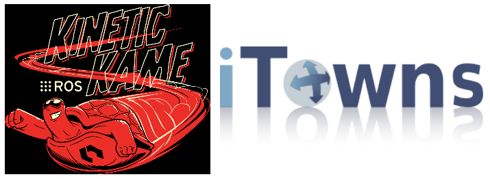
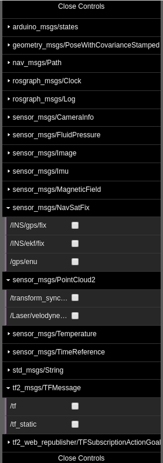

# ROS + iTowns

Ce projet a pour but d'intégrer des données issues des acquisitons ROS dans la plateforme iTowns. 


        
Pour cela, nous nous basons sur les bibliothèques ROSlibjs, qui permetd'extraire des informations de messages prédéfinis, et ROS3Djs qui permet d'afficher les données en webGL. 
Seulement la surcouche webGL d'iTowns n'est pas compatible avec le surcouche webGL de ROS 3D, il faut donc adapter les deux librairies.




## Table des matières

1. [Installation](#installation-sur-ubuntu)
2. [Implémentation](#impl%C3%A9mentation)
3. [Lancement de l'application](#lancement-de-lacquisiton)
4. [API](#api)
5. [Problèmes rencontrés](#probl%C3%A8mes-rencontr%C3%A9s)
6. [Etat de l'art du projet](#etat-de-lart-du-projet) 

## Installation sur ubuntu

### itowns
On peut trouver l'ensemble du projet itowns à l'adresse suivante : https://github.com/iTowns/itowns/tree/ros         


Pour l'installer, il suffit alors de cloner l'adresse suivante dans un dossier prévu à cette effet : 

                                 $ git clone https://github.com/iTowns/itowns.git

Sur itowns, une branche (ros) est dédiée à l'ajout des données provenant d'acquisitons avec ROS.    
Il faut alors se rendre dans cette branche : `$ git checkout ros`   
Puis installer les dépendances nécessaires au bon fonctionnement de l'application : `$ npm install`   
Et enfin mettre en route l'application : `$ npm start`

### ROS
Afin d'avoir accès à tous les outils nécessaires à l'utilisation de ROS dans ce projet, il est nécessaire d'installer plusieurs modules :   
* [ROS Kinetic](wiki.ros.org/kinetic/Installation/Ubuntu) - Gestion des différents flux d'informations
* [ROSBride](wiki.ros.org/rosbridge_suite/Tutorials/RunningRosbridge) - Proxy qui donne accès aux flux d'informations
* [Roslibs.js](wiki.ros.org/roslibjs) - Permet la connexion de la websocket de ROS au Bridge
* [Ros3D.js](wiki.ros.org/ros3djs) - Permet l'ajout d'objet THREE.js au projet

**[Retour en haut de la page](#table-des-matières)** 

## Implémentation

L'implémentation comprend plusieurs étapes : 
- Création et diffusion des données ROS (webSockets)
- Récupération des différents messages proposés par ROS 
- Création d'un menu en fonction des messages reçus
- Interaction avec le menu par le biais d'un affichage des données (utilisation des handlers existants et création si besoin)
- Correction de la librairie ros3Djs
- Affichage des données ROS et tests en localhost
- Re-agencement des repères de chaque message
- Intégration de l'implémentation dans itowns

## Lancement de l'acquisiton

### Initialisation de l'environnement

Il est tout d'abord primordial d'entrer la commande suivante dans chacun des terminaux que nous utiliserons.
```
source /opt/ros/kinetic/setup.bash
```
Cette ligne de commande permet en effet de configurer l'environnement ROS de travail. 

### Lancement du serveur

Pour lancer le serveur websocket de ROS il faut entrer la commande suivante dans un terminal indépendant : 
```
roslaunch rosbridge_server rosbridge_websocket.launch
```
Cette commande permet de créer la connexion entre la websocket de ROS et le Bridge (proxy).        
L'écoute des données s'effectue en local sur le port 9090. 

### Lancement du RosBag de test

Afin de produire un flux de données utiles, on utilise un document BAG.    
Dans un nouveau terminal, on lance la lecture du document en utilisant la commande suivante : 
```
rosbag play -l  LIEN VERS LE DOCUMENT BAG
```
L'option -l permet de faire tourner le document en boucle pour effectuer nos tests sur un document qui contient peu de données et qui est donc plus facilement portable. 

### Recupération des données 
Une fois ces opérations terminées, il est possible de récupérer les données dans le document source en javascript 
?????

**[Retour en haut de la page](#table-des-matières)** 

## API

### Les messages proposés



Ce menu de messages est obtenu en récupérant le flux de données issus de la websocket de ROS. 

### Visualisation des résultats

Les messages actuellement pris en compte par l'application sont : 
- tf2_msgs/TFMessage : données de base sur les différents repères. Il est nécessaire de le cocher avant tout traitement.
- sensor_msgs/NavSatFix : données de position du porteur 
- sensor_msgs/Camerainfo : données de position des caméras 
- sensor_msgs/PointCloud2 : nuage de points récupéré par les équipements de mesure (n'est pas fonctionnel)

## Problèmes rencontrés

### Librairie ROS3Djs non fonctionnelle

... to do ... (le problème rencontré + solution proposée)


### Outils de developpement compliqué à manipuler

... to do ... (pb c'est importation en dur dans le code, donc fork, rawgit pour accéder au code modifié car pas d'accès comme une librairie et nouvelle version de commit à chaque fois)

**[Retour en haut de la page](#table-des-matières)** 

## Etat de l'art du projet

En l'état actuel le projet n'est pas terminé. En effet, le problème de l'affichage des points n'ayant pas été résolu nous n'avons pas pu poursuivre le traitement des données.     
Nous avons donc réalisé l'implémentation jusqu'à la correction de la librairie ros3djs. L'étape suivante (une fois le bug corrigé) serait alors de mettre toutes les données dans un repère unique grâce aux messages récupérés dans /tf puis de visualiser ces éléments dans itowns.  

**[Retour en haut de la page](#table-des-matières)** 

## Authors

* **Rose Mathelier**
* **Augustin Gagnon**
* **Laure Le Breton**

**[Retour en haut de la page](#table-des-matières)** 
